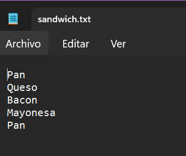
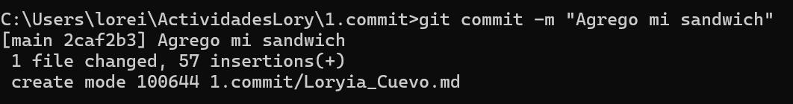
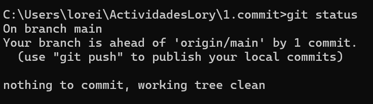
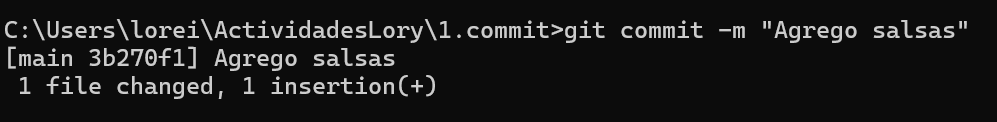
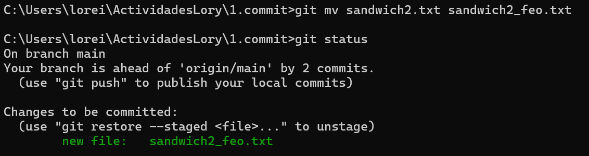

1.1 Preguntas
1. ¿Cómo se inicializa un repositorio local? (que comando se debe ejecutar?)
	git init

2. ¿Cómo hago para que un directorio deje de ser controlado por git? (que comando se debe ejecutar?)
	rm -rf .git

3. Si agrego un archivo a un directorio que ya está siendo controlado por git, ¿está siendo controlado por git?
	No, primero tiene que añadirse con "git add"

4. ¿Qué comando se utiliza para agregar un archivo al repositorio local?
	git add nombre_del_archivo

5. ¿Cómo determino que archivos fueron modificados? (que comando se debe ejecutar?)
	git status

6. ¿Qué comando se utiliza para hacer un commit?
	git commit -m "mensaje del commit"

7. En sus propias palabras, ¿qué es un commit?
	Un commit sirve para guardar y registrar cambios en tu proyecto de forma organizada dentro de un repositorio.

    

1.2 Ejercicio Práctico
1. Crear un archivo nombre_apellido.txt si no estaba creado previamente.
		
2. Agregar a sandwich.txt condimentos e ingredientes que le gusten, simulando que es un sandwich que se va a comer.
		
        
3. Antes de realizar cualquier acción con git, guarde el estado actual del directorio en el archivo nombre_apellido.txt. Para esto, se debe ejecutar el comando git status y copiar el resultado en el archivo nombre_apellido.txt. Explique que significa la salida del comando.
		On branch main
Your branch is up to date with 'origin/main'.

Untracked files:
  (use "git add <file>..." to include in what will be committed)
        sandwich.txt

nothing added to commit but untracked files present (use "git add" to track)

4. Agregar el archivo sandwich.txt al repositorio local. Para esto, se debe ejecutar el comando git add sandwich.txt.
		
5. Explique que cambio en la salida del comando git status luego de ejecutar el comando git add sandwich.txt.
		On branch main
	Your branch is up to date with 'origin/main'.

	Changes to be committed:
  	(use "git restore --staged <file>..." to unstage)
        	new file:   sandiwch.txt
        
6. Realizar un commit con el mensaje "Agrego mi sandwich.txt". Para esto, se debe ejecutar el comando git commit -m "Agrego mi sandwich.txt".
		

7. Explique que cambio en la salida del comando git status luego de ejecutar el comando git commit -m "Agrego mi sandwich.txt".
		

8. Agregar salsas de su preferencia a sandwich.txt y realizar un commit con el mensaje "Agrego salsas".
		

9. Escriba la salida del comando git log en el archivo nombre_apellido.txt. Y explique que significa. ¿En qué orden aparecen los commits?
		git log Loryia_Cuevo.md
	commit 2caf2b3d0d4facf130a4e2e94e088a0f2e4be81d
	Author: loreiish <loreishush@gmail.com>
	Date:   Mon May 19 13:52:12 2025 +0200
10. Pruebe las variaciones del comando git log y explique que observa en cada una de ellas. 10.1. git log --oneline 10.2. git log --stat
		Muestra los "commits". Muestra los archivos modificados.

11. Inspeccione diferencias entre los commits, use el comando git diff y explique que significa cada uno de los resultados. 11.1. En Windows, pruebe git difftool --tool=meld <hash> 11.2. En Linux, pruebe git difftool --tool=opendiff <hash>
		Muestra las diferencias entre los archivos antes de hacer commit.

12. Crear un nuevo archivo dentro de la carpeta 1.commit, llamado sandwich2.txt, y agregarle los ingredientes de su sandwich.

13. Agregar el archivo sandwich2.txt al repositorio local.

14. Renombrar el archivo sandwich2.txt a sandwich2_feo.txt. Para esto, se debe ejecutar el comando git mv sandwich2.txt sandwich2_feo.txt. Explique que cambio en la salida del comando git status luego de hacer un commit con esos cambios y de git log --oneline.
		
		>git log --oneline
	31dd317 (HEAD -> main) sandwich feo
	
15. Borre el archivo sandwich2_feo.txt. Para esto, se debe ejecutar el comando git rm sandwich2_feo.txt. Explique que cambio en la salida del comando git status luego de hacer un commit con esos cambios y de git log --oneline.

16. Inspeccione la bitácora usando git log --stat y explique lo que ve.
